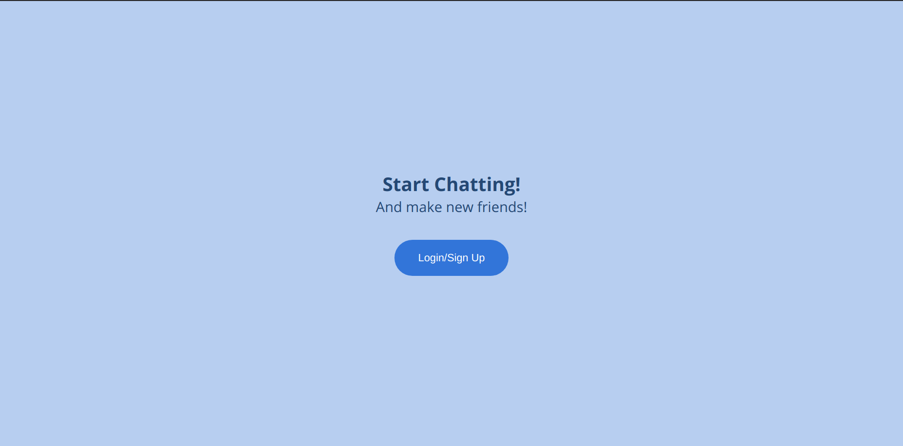
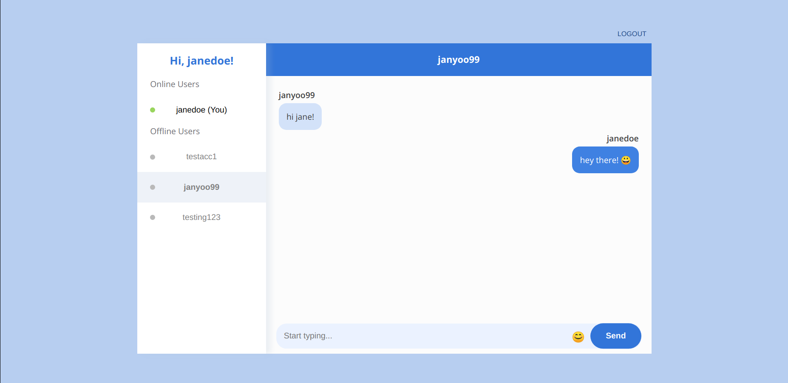
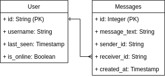

# Milestone 3 - Chat App
This is a simple one-to-one chat app where you can chat with any registered user! This was definitely difficult to grapple with as I was introduced to all sorts of new technologies such as ApolloClient, Hasura GraphQL Engine, GraphQL and it's many functionalities, authentication with Auth0 (I am still very much overwhelmed by the realm of authentication), and React Hooks.

This project was bootstrapped with [Create React App](https://github.com/facebook/create-react-app).

## Screenshots

### To try it out:
1. Go [here](https://kind-lichterman-af25ee.netlify.app/) to open the web app.
2. Log in as a test user:
    * Username: janedoe
    * Password: Testing12345
3. Chat with random users shown on the left sidebar!

## Technology Used
* React
* Hasura GraphQL Engine to serve the backend and conveniently provide a GraphQL API over a PostGres database
* GraphQL
* ApolloClient to communicate to a GraphQL server
* Auth0 for user authentication

## Data Models

## Available Scripts

In the project directory, to install all dependencies, you can run:

### `npm i`

To start the local development server, you can run: 

### `npm run start`

Runs the app in the development mode. 
Open [http://localhost:3000](http://localhost:3000) to view it in the browser.

The page will reload if you make edits. 
You will also see any lint errors in the console.

## Future endeavors
Hasura GraphQL was a great tool to use as it helped me get started with my chat app fairly quickly, creating a GraphQL API for me. However, I think I'll challenge myself to look into Sequelize to learn how create my own GraphQL API and expand my chat app even further!

Future features:
* Friends list
* Typing indicator
* Notifications
* Faster messages :O
